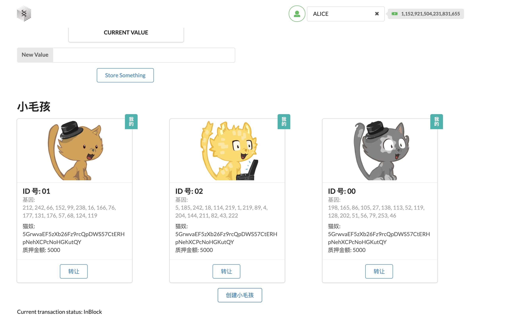
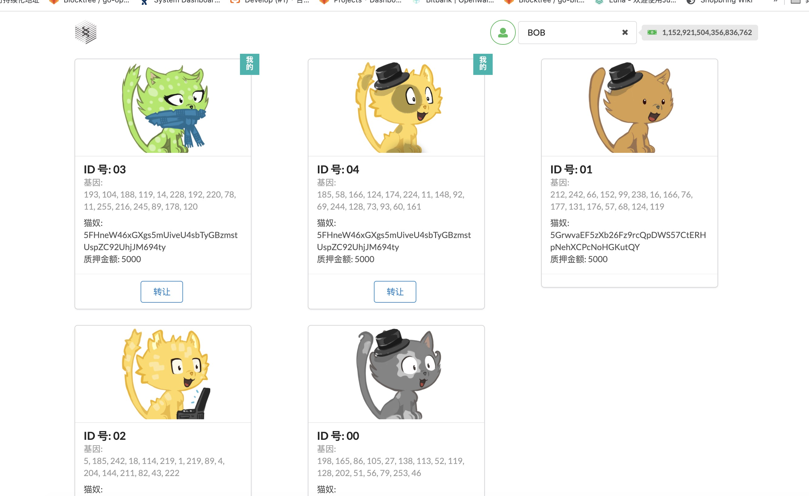
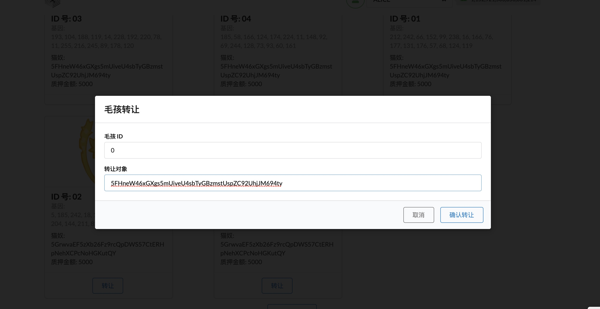
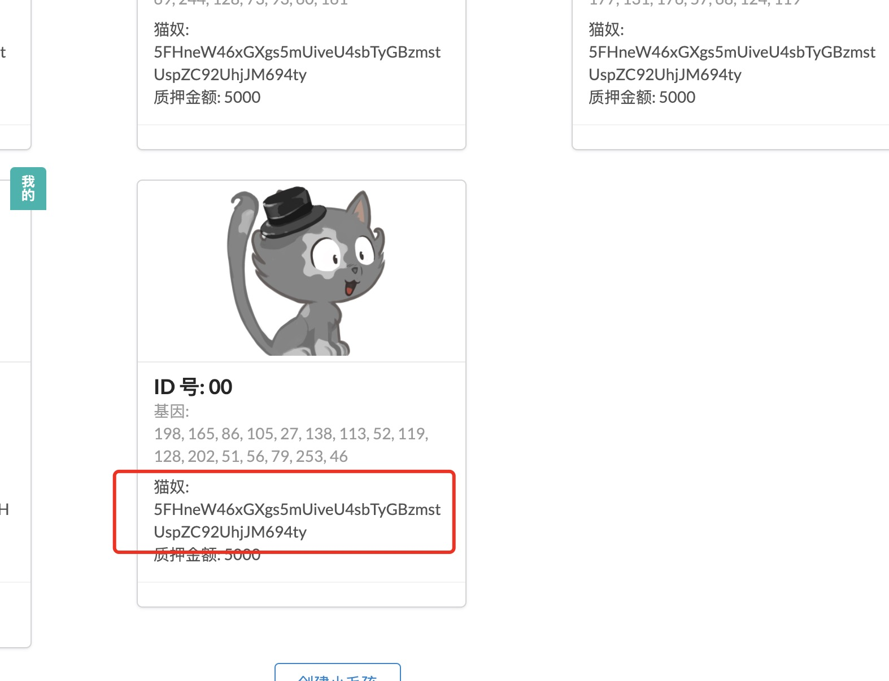

# 第三课作业 (源码在pallets/poe,runtime 已)

##

上一课链接，包括修改运行runtime的代码 https://github.com/kencani/sub_homework

## 第一题
## 第二题 创建小毛孩并展示是不是你的






## 第三题 交易小毛孩






## 能在 react 端组合回需要的数组结构 
关键代码

```rust

 let unSub = null

    const asyncFetch = async () => {
      unSub = await api.query.kittiesModule.kittyCnt(async cnt => {
        
        const entries = await api.query.kittiesModule.kitties.entries()
        const indexs = entries.map(convertToKittyIndex)
        setKittyIndexs(indexs)
      })
    }


```


```rust
    let unSub = null

    const asyncFetch = async () => {
        unSub = await api.query.kittiesModule.kitties.multi(kittyIndexs, kitties => {
        const kittyArr = kitties
        .map((kitty, ind) => constructKitty(kittyIndexs[ind], kitty.value))
        setKitties(kittyArr)
    })
}


#### type 添加返回

```rust

"Gender": {
    "_enum": [
        "Male",
        "Female"
    ]
},
"Kitty": {
    "dna": "[u8; 16]",
    "price": "Option<Balance>",
    "gender": "Gender",
    "owner": "AccountId",
    "deposit": "Balance"
}


```
    


```

